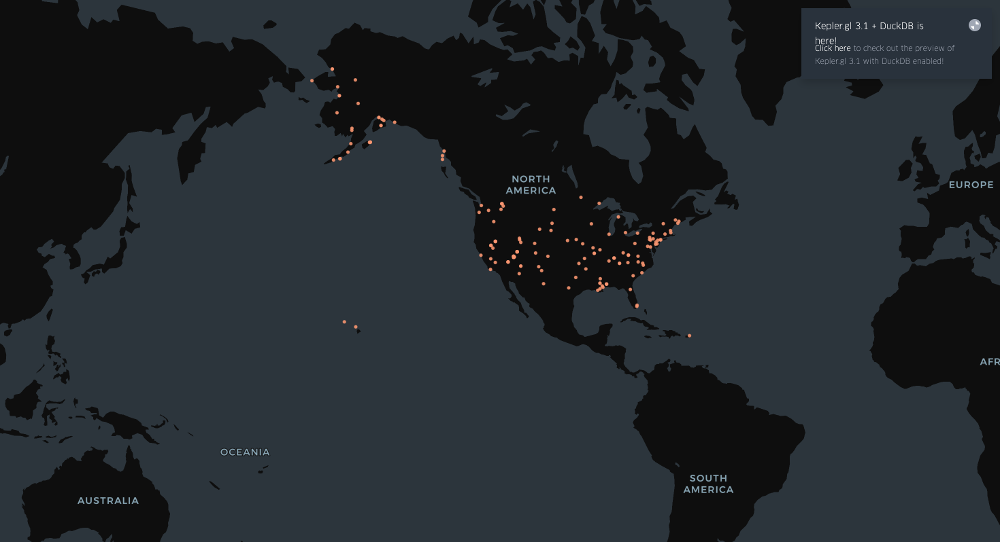

# Privatisation_Database
# 🏞️ At-Risk Federal Land: Identifying Privatization Candidates

This project analyzes publicly available federal property data to identify parcels of land that may be at risk of privatization. It focuses on converting and visualizing geospatial data to support public transparency and further research.

---

## 🔍 Objective

To explore patterns and characteristics of federal land that has been marked as **“at risk”** for privatization using historical property records. The aim is to provide an accessible, mapped dataset that can be used by journalists, activists, or policymakers to better understand federal land management trends.

---

## 🧠 Methodology

1. **Data Conversion**
   - Cleaned and structured the `at_risk_parcels` dataset for analysis

2. **Keyword Extraction**
   - Used NLP techniques to extract key terms from property descriptions and agency reports
   - Helped flag potential indicators of privatization (e.g., "excess", "disposal", "no longer required")

3. **LLM-Assisted Geolocation**
   - For records with missing or ambiguous coordinates, LLMs were used to predict **latitude and longitude** based on location metadata (e.g., parcel name, county, state)

4. **Mapping**
   - Uploaded the dataset to [Kepler.gl](https://kepler.gl/) for interactive geospatial visualization
   - Color-coded by agency or land type

---

## 📦 Files

- `at_risk_parcels.csv` – Cleaned and geolocated dataset
- `visualization.png` – Map-based or data visualization

---

## 🗺️ Sample Visualization

---

## 🧰 Tools Used

- **Python (pandas, sqlite3)** – to extract and transform data
- **OpenAI / Transformers** – for LLM-based inference
- **spaCy / KeyBERT** – for keyword and topic extraction
- **Kepler.gl** – for interactive mapping and filtering
- **Jupyter Notebook** *(optional)* – for prototyping and exploration

---

## 🗂️ Table Schema

The dataset `at_risk_parcels.csv` contains:

| Column Name       | Description                                   |
|-------------------|-----------------------------------------------|
| `id`              | Unique identifier                             |
| `parcel_name`     | Name of the land parcel                       |
| `agency`          | Owning federal agency                         |
| `state`           | U.S. state where parcel is located            |
| `county`          | County name                                   |
| `latitude`        | Latitude coordinate (predicted if missing)    |
| `longitude`       | Longitude coordinate (predicted if missing)   |
| `land_type`       | Type of land (BLM, USFS, etc.)                |
| `acres`           | Parcel size in acres                          |

---

## 🚀 How to Use

1. Clone this repo
2. Open `at_risk_parcels.csv` in your tool of choice (Excel, Python, R)
3. Or upload it to [Kepler.gl](https://kepler.gl/) to view the parcels on an interactive map
4. Filter by agency, location, or land type to uncover trends

---

## 📚 Data Source

This dataset is compiled from the **Federal Real Property Profile (FRPP)** and land records from agencies such as **BLM** and **USFS**, covering properties from 2005 to 2025.

---

## 🧩 Future Work

- Add historical trends in property transfers
- Cross-reference with political or environmental risk zones
- Automate LLM-based location inference for new parcels
